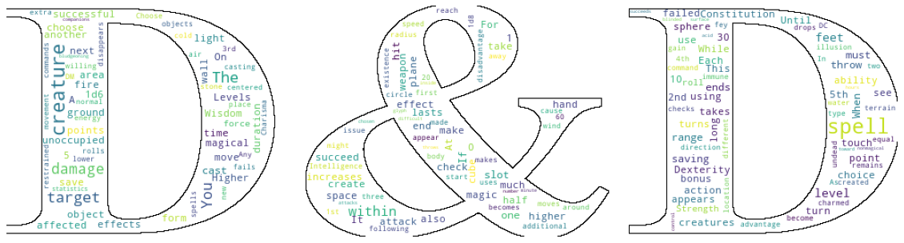

## Downloading libraries


```python
!pip install wordcloud
```

    Requirement already satisfied: wordcloud in c:\programdata\anaconda3\lib\site-packages (1.8.2.2)
    Requirement already satisfied: matplotlib in c:\programdata\anaconda3\lib\site-packages (from wordcloud) (3.5.1)
    Requirement already satisfied: numpy>=1.6.1 in c:\programdata\anaconda3\lib\site-packages (from wordcloud) (1.21.5)
    Requirement already satisfied: pillow in c:\programdata\anaconda3\lib\site-packages (from wordcloud) (9.0.1)
    Requirement already satisfied: packaging>=20.0 in c:\programdata\anaconda3\lib\site-packages (from matplotlib->wordcloud) (21.3)
    Requirement already satisfied: python-dateutil>=2.7 in c:\programdata\anaconda3\lib\site-packages (from matplotlib->wordcloud) (2.8.2)
    Requirement already satisfied: kiwisolver>=1.0.1 in c:\programdata\anaconda3\lib\site-packages (from matplotlib->wordcloud) (1.3.2)
    Requirement already satisfied: pyparsing>=2.2.1 in c:\programdata\anaconda3\lib\site-packages (from matplotlib->wordcloud) (3.0.4)
    Requirement already satisfied: fonttools>=4.22.0 in c:\programdata\anaconda3\lib\site-packages (from matplotlib->wordcloud) (4.25.0)
    Requirement already satisfied: cycler>=0.10 in c:\programdata\anaconda3\lib\site-packages (from matplotlib->wordcloud) (0.11.0)
    Requirement already satisfied: six>=1.5 in c:\programdata\anaconda3\lib\site-packages (from python-dateutil>=2.7->matplotlib->wordcloud) (1.16.0)
    

## Importing libraries


```python
import numpy as np # linear algebra
import pandas as pd # data processing, CSV file I/O (e.g. pd.read_csv)
```


```python
import nltk
nltk.download('punkt')
from nltk import wordpunct_tokenize
nltk.download('stopwords')
from nltk.corpus import stopwords
```

    [nltk_data] Downloading package punkt to C:\Users\Jonathan
    [nltk_data]     Oliva\AppData\Roaming\nltk_data...
    [nltk_data]   Package punkt is already up-to-date!
    [nltk_data] Downloading package stopwords to C:\Users\Jonathan
    [nltk_data]     Oliva\AppData\Roaming\nltk_data...
    [nltk_data]   Package stopwords is already up-to-date!
    


```python
import os
print(os.listdir())
```

    ['.git', '.ipynb_checkpoints', 'dataset', 'LICENSE', 'README.md', 'wordcloud1.jpg', 'wordcloud_demostration.ipynb']
    


```python
from wordcloud import WordCloud
import matplotlib.pyplot as plt
from PIL import Image
```

## Downloading data


```python
mydata = "dataset"
```


```python
print(os.listdir(mydata))
```

    ['dnd-spells.csv', 'dnd.png']
    


```python
df_dataset = pd.read_csv(mydata+"/dnd-spells.csv")
```


```python
df_dataset[:5]
```


<div>
<style scoped>
    .dataframe tbody tr th:only-of-type {
        vertical-align: middle;
    }

    .dataframe tbody tr th {
        vertical-align: top;
    }

    .dataframe thead th {
        text-align: right;
    }
</style>
<table border="1" class="dataframe">
  <thead>
    <tr style="text-align: right;">
      <th></th>
      <th>name</th>
      <th>classes</th>
      <th>level</th>
      <th>school</th>
      <th>cast_time</th>
      <th>range</th>
      <th>duration</th>
      <th>verbal</th>
      <th>somatic</th>
      <th>material</th>
      <th>material_cost</th>
      <th>description</th>
    </tr>
  </thead>
  <tbody>
    <tr>
      <th>0</th>
      <td>Acid Splash</td>
      <td>Artificer, Sorcerer, Wizard</td>
      <td>0</td>
      <td>Conjuration</td>
      <td>1 Action</td>
      <td>60 Feet</td>
      <td>Instantaneous</td>
      <td>1</td>
      <td>1</td>
      <td>0</td>
      <td>NaN</td>
      <td>You hurl a bubble of acid. Choose one creature...</td>
    </tr>
    <tr>
      <th>1</th>
      <td>Blade Ward</td>
      <td>Bard, Sorcerer, Warlock, Wizard</td>
      <td>0</td>
      <td>Abjuration</td>
      <td>1 Action</td>
      <td>Self</td>
      <td>1 round</td>
      <td>1</td>
      <td>1</td>
      <td>0</td>
      <td>NaN</td>
      <td>You extend your hand and trace a sigil of ward...</td>
    </tr>
    <tr>
      <th>2</th>
      <td>Booming Blade</td>
      <td>Artificer, Sorcerer, Warlock, Wizard</td>
      <td>0</td>
      <td>Evocation</td>
      <td>1 Action</td>
      <td>Self (5-foot radius)</td>
      <td>1 round</td>
      <td>0</td>
      <td>1</td>
      <td>1</td>
      <td>a melee weapon worth at least 1 sp</td>
      <td>You brandish the weapon used in the spell’s ca...</td>
    </tr>
    <tr>
      <th>3</th>
      <td>Chill Touch</td>
      <td>Sorcerer, Warlock, Wizard</td>
      <td>0</td>
      <td>Necromancy</td>
      <td>1 Action</td>
      <td>120 Feet</td>
      <td>1 round</td>
      <td>1</td>
      <td>1</td>
      <td>0</td>
      <td>NaN</td>
      <td>You create a ghostly, skeletal hand in the spa...</td>
    </tr>
    <tr>
      <th>4</th>
      <td>Control Flames</td>
      <td>Druid, Sorcerer, Wizard</td>
      <td>0</td>
      <td>Transmutation</td>
      <td>1 Action</td>
      <td>60 Feet</td>
      <td>Instantaneous or 1 hour</td>
      <td>0</td>
      <td>1</td>
      <td>0</td>
      <td>NaN</td>
      <td>You choose nonmagical flame that you can see w...</td>
    </tr>
  </tbody>
</table>
</div>


## Preprocessing Data

### Eliminate, if exist,  null values in description


```python
def calcData(row):
    counter = 0
    for element in row:
        if element == True:
            counter+=1
    return counter
```


```python
df_dataset.isnull().apply(lambda x: calcData(x))
```


    name               0
    classes            0
    level              0
    school             0
    cast_time          0
    range              0
    duration           0
    verbal             0
    somatic            0
    material           0
    material_cost    264
    description        0
    dtype: int64


### Eliminate, if exist, duplicate values in description 


```python
sum(df_dataset.duplicated('description'))
```


    0


### Creating Dataset 


```python
stopwords_english = set(stopwords.words('english'))
```


```python
len(stopwords_english)
```


    179


```python
def createCloudUnigrams(x):
    y = nltk.word_tokenize(x)
    
    return [word for word in y if not word in stopwords_english and word.isalnum()]
    
```


```python
df_dataset['unigrams'] = df_dataset.apply(lambda x: createCloudUnigrams(x['description']),axis=1)
```


```python
df_dataset['unigrams'][:5]
```


    0    [You, hurl, bubble, acid, Choose, one, creatur...
    1    [You, extend, hand, trace, sigil, warding, air...
    2    [You, brandish, weapon, used, spell, casting, ...
    3    [You, create, ghostly, skeletal, hand, space, ...
    4    [You, choose, nonmagical, flame, see, within, ...
    Name: unigrams, dtype: object


```python
unigrams = df_dataset['unigrams']
cloud_set = {}

for terms in unigrams:
    counter = 0
    for term in terms:
        cloud_set[term] = cloud_set.get(term,0) + 1
```


```python
dict(list(cloud_set.items())[:10])
```


    {'You': 660,
     'hurl': 9,
     'bubble': 1,
     'acid': 37,
     'Choose': 56,
     'one': 379,
     'creature': 1298,
     'within': 603,
     'range': 359,
     'choose': 187}


## Generating Wordcloud


```python
# getting figure
tweet_mask = np.array(Image.open(mydata + "/dnd.png"))
```


```python
wc = WordCloud(background_color="white", mask=tweet_mask,contour_width=1)
wc.generate_from_frequencies(cloud_set)
plt.figure( figsize=(20,20))
plt.imshow(wc)
plt.axis("off")
plt.show()
```


    

    

